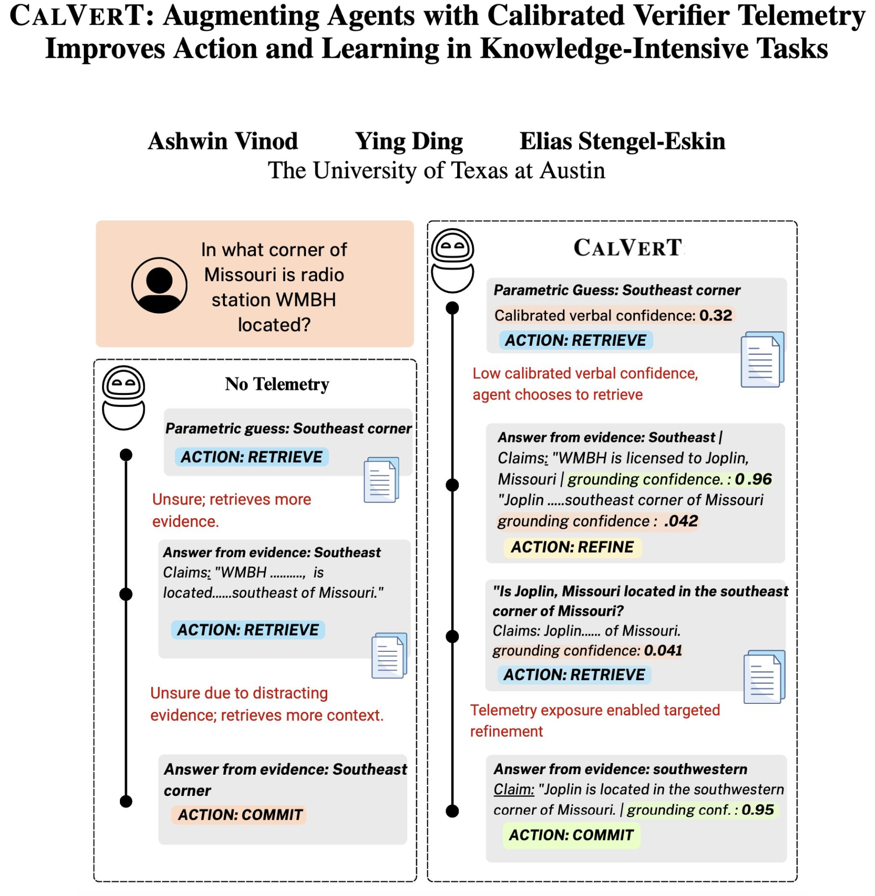

### CalVerT: Augmenting Agents with Calibrated Verifier Telemetry Improves Action and Learning in Knowledge-Intensive Tasks

Authors: [Ashwin Vinod](https://ashwinn-v.github.io/) | [Ying Ding](https://yingding.ischool.utexas.edu/) |  [Elias Stengel-Eskin](https://esteng.github.io/)

[](https://arxiv.org/abs/2606.21777)

<p align="center">
  
</p>

<p align="center">
  Exposing calibrated confidence and grounding signals to the agent at each turn leads to better action choices.
  <b>Left:</b> Without telemetry, the agent retrieves additional evidence but still stops with an unsupported answer to the subquestion, resulting in an incorrect final answer.
  <b>Right:</b> Our method exposes low confidence and weak grounding through verifier telemetry, prompting the agent to retrieve more evidence when needed, refine the answer for targeted retrieval, and commit only once the answer is well grounded.
</p>


### Abstract
LLM agents in knowledge intensive question answering take retrieval and reasoning actions with incomplete knowledge about whether their current answer is uncertain, unsupported, or already complete. This produces two failure modes: committing to confident but unsupported answers, which hurts accuracy, and over- retrieving when the evidence in hand already suffices, resulting in wasted compute. To give agents a more complete picture of the state space they are operating in, we introduce calibrated verifier telemetry (CalVerT), which augments the agent’s state with additional telemetry: a calibrated self-confidence score and grounding verifier score. We show that CalVerT can improve agents both in training- free and training-based settings. On four QA benchmarks, we find that CalVerT raises F1 while cutting redundant retrieval, where agents over-search and trigger retrieval in cases where agents over-rely on parametric knowledge. We show that CalVerT can augment existing QA frameworks without training. Moreover, CalVerT also improves trained systems: by simply augmenting an agent’s state with telemetry, we observe improvements after reinforcement learning, as compared to an agent with identical training but no CalVerT telemetry.

## Install and Setup

```bash
git clone https://github.com/ashwinn-v/CalVerT.git
cd CalVerT
python -m venv .venv && source .venv/bin/activate
pip install -e ".[grpo,test]"
export TELEMETRY_AGENT_ROOT="$PWD"
```

The eval runners assume vLLM compatible GPUs. CPU-only smoke runs work for
the tests in `tests/` but not for full DINCO + MiniCheck inference.

## CalVerT on Multihop QA

```bash
# 1. Pull HotpotQA distractor split and build the per-question BM25 index.
bash scripts/download_hotpotqa.sh
bash scripts/build_hotpotqa_index.sh

#Change dataset name to evaluate on 2Wiki (2WikiMultihopQA) and MuSiQue


# 2. Paired role vs no_telemetry evaluation on Qwen3-32B at N=300 dev.
bash scripts/run_hotpotqa_role_beam.sh
```

## CalVerT on single hop WiTQA

```bash
bash scripts/download_witqa.sh
bash scripts/build_witqa_index.sh
bash scripts/run_witqa_role_beam.sh
```

## closed-book DINCO on TriviaQA

```bash
bash scripts/download_triviaqa.sh
bash scripts/run_triviaqa_closed_book.sh
```

## GRPO training

See `grpo/README.md` for the Tinker SDK path (rank-16 LoRA on Qwen3-8B or
Qwen3-30B-A3B MoE).

## Environment variables

| Variable | When needed |
|---|---|
| `HF_TOKEN` | Gated models (e.g., MiniCheck weights); reading datasets |
| `TINKER_API_KEY` | GRPO training via Tinker SDK |
| `WANDB_API_KEY` | Optional; enables wandb logging during training |
| `CLUSTER_NAME` | Optional label written into result JSONLs for when evaluating on clusters |
| `ENV_VARS` | All other API keys and VARS setup |

## Models


- **Generator:** Qwen3-32B, Qwen3-8B; Mistral-Small-24B-Instruct; any
  vLLM-compatible chat model with HF chat templates is compatible for eval.
- **Grounding verifier:** `https://huggingface.co/bespokelabs/Bespoke-MiniCheck-7B`.
- **NLI for DINCO:** `https://huggingface.co/MoritzLaurer/DeBERTa-v3-base-mnli-fever-anli`.

## Citation
## Citation

If you find this work useful, please cite:

```bibtex
@misc{vinod2026calvertaugmentingagentscalibrated,
      title={CalVerT: Augmenting Agents with Calibrated Verifier Telemetry Improves Action and Learning in Knowledge-Intensive Tasks}, 
      author={Ashwin Vinod and Ying Ding and Elias Stengel-Eskin},
      year={2026},
      eprint={2606.21777},
      archivePrefix={arXiv},
      primaryClass={cs.CL},
      url={https://arxiv.org/abs/2606.21777}, 
}

```

## License

MIT. See `LICENSE`.


